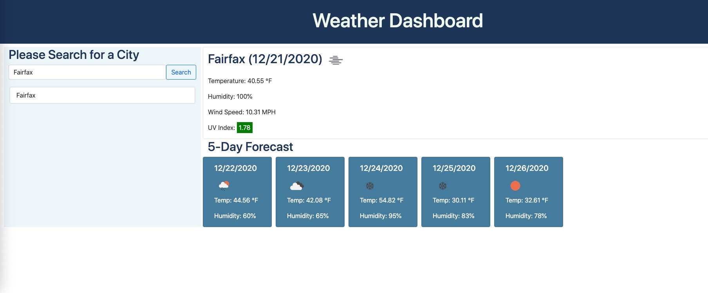
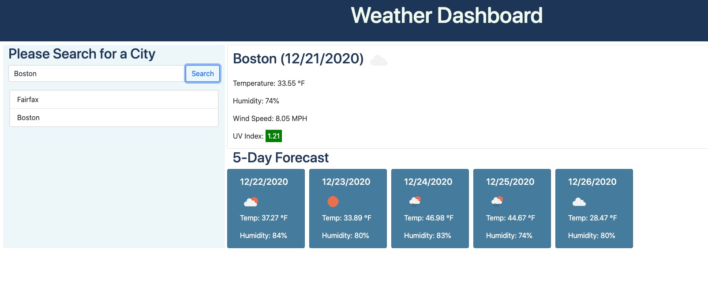

# Weather Dashboard

## User Story

```
AS A traveler
I WANT to see the weather outlook for multiple cities
SO THAT I can plan a trip accordingly
```

# Description

This is an application that users can get weather information for different cities all over the world.

Once users search for a city, the current weather and 5-day forecast will be displayed. 

Current weather information includes the temperature, the humidity, the wind speed, and the UV index.

for the UV index, the favorable conditions will be in green, the moderate conditions will be in yellow, and the severe conditions will be in red.

When users click on a city in the search history, they will be presented with current and future conditions for that city.

When they open the weather dashboard again, the last searched city forecast will be presented.

# Screenshots

The following image shows this weather dashboard application's appearance and functionality:




# Links

* The URLs of the deployed website: https://mengyue-z.github.io/weather-dashboard/

* The URLs of the GitHub repositories: https://github.com/mengyue-z/weather-dashboard

